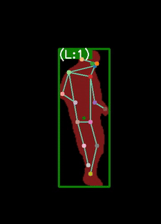

# PoseLift: Exploring Pose-Based Anomaly Detection for Retail Security: A Real-World Shoplifting Dataset and Benchmark

## Overview
This directory contains the PoseLift dataset published in WACV 2025 conference. PoseLift is a dataset created specifically for detecting shoplifting behaviors using pose-based anomaly detection techniques. Built in collaboration with a retail store, PoseLift captures real-world shopping and shoplifting behaviors while addressing key challenges such as privacy concerns. The PoseLift dataset includes pose sequence data and frame-level labels for shoplifting. You can find the paper in the following link: [Exploring Pose-Based Anomaly Detection for Retail Security: A Real-World Shoplifting Dataset and Benchmark.](https://arxiv.org/abs/2501.06591)

## Dataset Description

### Features 
1- **Privacy-Preserving**
The dataset includes pose sequences derived from CCTV footage, with anonymized human identities and no raw pixel-level video data. This ensures full following of privacy regulations and safeguards individual privacy.


2- **Real-World Data**: PoseLift is developed through close collaboration with a local retail store, ensuring that it captures authentic shoplifting incidents alongside normal shopping behaviors in real-world retail environment.

3- **Pose-Based Annotations**: PoseLift provides bounding boxes, person IDs, and human pose annotations instead of raw videos to support privacy-preserving shoplifting detection.


4- **Camera Views**: The dataset utilizes videos from 6 indoor cameras (C1 to C6) positioned across various aisles and locations in a local retail store in the USA. 
<div align="center">
  
  <p><em>Figure 1: Segmented images from six camera views within a retail store, used in the PoseLift dataset.</em></p>
</div>

5- **Diverse Shoplifting Behaviors**: The dataset includes a wide range of normal shopping behaviors alongside real shoplifting activities. The shoplifting behaviors demonstrated in these videos included actions such as placing items into pockets, placing them in bags, and hiding them under shirts, jackets, and pants. 


<table>
  <tr>
    <td style="text-align: center;">
      <br />
      Hiding an item in their pants
    </td>
    <td style="text-align: center;">
      <br />
      Hiding an item under their T-shirt
    </td>
    <td style="text-align: center;">
      <br />
      Placing an item in their pockets
    </td>
  </tr>
</table>

6- **Shoplifting and Shopping Instances**: The dataset consists of 153 instances, including 43 instances of shoplifting and 112 regular shopping files. These were captured from various angles and locations to ensure diverse scenarios.


## Data Processing
- **Video Lengths & Frame Rates**: Original videos range from a few seconds to over 5 minutes, with a resolution of 1920x1080 and a frame rate of 15 fps.

  
- **Pose Data Extraction**: Anonymized pose data is extracted using state-of-the-art models, including YOLOv8 for object detection, ByteTrack for person tracking, and HRNet for human pose estimation.

  
- **Data Modifications**: To address occlusions caused by store shelves, specific areas of interest for each camera were defined. Missing poses were interpolated, and data smoothing was applied for continuity.


## Annotations and Shoplifting Labels:
To ensure privacy preservation, we provide a pickle file (in .pkl format) for each original video in our dataset and we realese the pickle files, resulting in a total of 153 annotation files corresponding to 153 original videos. The files are named according to the following pattern:

<camera_number>_<video_number>.pkl


Where camera_number refers to the specific camera that captured the video, and video_number serves as a unique identifier for each video recorded within the retail store.
Each file offer detailed frame-by-frame annotations, including Person ID, bounding box, and keypoints for each individual in the frame.
The annotations are organized in a dictionary structure, with each key representing a specific frame number. For each frame, the annotation includes:
- **Person ID**: A unique identifier for each individual detected in the frame.
- **Bounding Box**: Defined in the XYWH format, where X and Y are the coordinates, W is the width, and H is the height of the bounding box.
- **Keypoints**: Represented in the XYC format, where X and Y are the coordinates of key points, and C is the confidence score associated with the detection of each keypoint.


The anomaly labels are provided in .npy format, with one label file for each video. The labeling follows the same naming pattern as the corresponding video file, ensuring easy mapping between the pickle file and its labels. So,each label file contains a NumPy array of binary values (0s and 1s), categorizing all frames into two groups: normal behavior or shoplifting. The length of the array corresponds to the total number of frames in the respective video. A value of 0 indicates a "normal" frame, where no shoplifting behavior is detected. A value of 1 indicates an "anomalous" frame, where shoplifting behavior is identified based on the observed actions within that frame.

## Benchmarking

We provide benchmark results for the State-of-the-art pose-based anomaly detection models tested on the PoseLift dataset.


<sub> Table 1: Comparison of three performance metrics (AUC-ROC, AUC-PR, and EER) across three state-of-the-art models on the PoseLift dataset.
| Methods          | AUC-ROC | AUC-PR| EER |
|------------------|---------|-------|-----|
| STG-NF         |    67.46   | 84.06        | 0.39   |
|TSGAD           |   63.35    |  39.31       | 0.41    |
| GEPC          |   60.61    |  50.38       | 0.38  |


## Dataset Download Instructions
To download the annotations and anomaly labels, please use the following link:


[PoseLift](https://drive.google.com/drive/folders/1aEkENZlVE4ZvF_BZXV1VJOwuiXQq6trn?usp=sharing)

## Usage
PoseLift is designed for research on shoplifting detection, particularly in real-world retail settings. Researchers can use the dataset for:


•	Training and evaluating pose-based anomaly detection models.


•	Developing privacy-preserving systems for surveillance and security in retail environments.


•	Exploring methods for detecting complex behaviors like shoplifting in natural settings.


## Citation
If you find our work useful, please consider citing: 

```bibetex
@article{rashvand2025exploringposebasedanomalydetection,
      title={Exploring Pose-Based Anomaly Detection for Retail Security: A Real-World Shoplifting Dataset and Benchmark}, 
      author={Narges Rashvand and Ghazal Alinezhad Noghre and Armin Danesh Pazho and Shanle Yao and Hamed Tabkhi},
      year={2025},
      eprint={2501.06591},
      archivePrefix={arXiv},
      primaryClass={cs.CV},
      url={https://doi.org/10.48550/arXiv.2501.06591}
      }
```

## Contact
If you have any questions or need assistance, please contact the authors at nrashvan@charlotte.edu.
